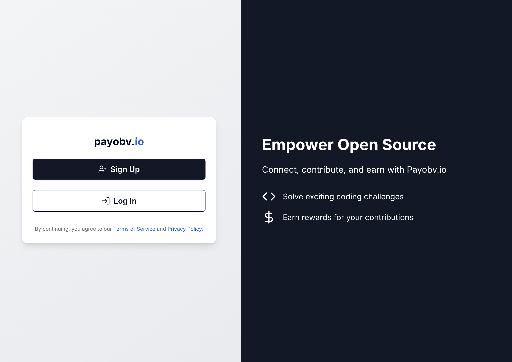

# Payobv.io - Obvious Payments for Open Source Contributors

Payobv.io is a platform that allows open source contributors to receive bounties from users of their projects. It is a simple and transparent way to support the people who create the software you use every day.

Please refer to the [project showcase](./docs/project-showcase.md) for more information.

## Overview

> The project can be found [here](https://payobv-io-ten.vercel.app/)

Below are the steps to use the platform:

1. **Onboarding Proceess**: The user has to complete the onboarding process by doing the following:
   - Connect their GitHub account
   - Connect Wallet
   - Select Role (Project Maintainer or Contributor)
   - Install our Github App and add repositories(only for Project Maintainers)
2. **Opening an Issue and Setting Bounty**: The Project Maintainer can open an issue and set a bounty on it. The bounty should be set in the Issue body or in the comments. 

> ❗Note: The bounty should be in the format `Bounty <amount in sols>`

3. **Escrow**: The Project Maintainer can escrow the bounty by clicking on the `Approve` button in [Escrow Requests](https://payobv-io-ten.vercel.app/escrow-requests) page and finish the transaction. The bounty will be locked in the escrow account.

4. **Contributing to the Issue**: The Contributors can contribute to the issue by submitting a PR. The Project Maintainer can review the PR and merge it. 

While opening the PR, the Contributor should reference the issue in the PR body.

> ❗Note: The issue reference should be in the format `Issue #<issue number>`

5. **Contributor Onboarding**: The Contributor has to complete the onboarding process.

6. **PR Merge and Bounty Release Initiation**: The Project Maintainer can merge the PR and release the bounty by clicking on the `Confirm Release` button in the [Dashboard](https://payobv-io-ten.vercel.app/maintainer/dashboard).

7. **Bounty Release**: The bounty will be released to the Contributor's wallet.

## Project Showcase

Please refer to the [project showcase](./docs/project-showcase.md) for more information.

